<div align="center">

# 🏥 Vitals — Healthcare Backend System

### A production-style patient & doctor management backend, built with Django REST Framework, PostgreSQL and JWT — with a dashboard UI good enough to actually demo.


</div>

---

## 📌 About the Project

**Vitals** is a secure, RESTful healthcare backend that lets clinicians register, log in, and manage **patient records**, **doctor rosters**, and **patient–doctor care assignments** — with every write scoped to the authenticated user and every response following a single, predictable error format.

It was built to go beyond a typical assignment: instead of stopping at working endpoints, it ships with a fully functional, dark-themed **clinical dashboard UI** (served directly by Django, no separate frontend build) so the API isn't just something you test in Postman — it's something you can actually *demo*.

---

## ✨ Key Features

- 🔐 **JWT Authentication** — register, login, and silent token refresh via `djangorestframework-simplejwt`
- 🧑‍⚕️ **Patients API** — full CRUD, strictly scoped to the clinician who created each record
- 👨‍⚕️ **Doctors API** — full CRUD, visible to every authenticated user
- 🔗 **Patient ↔ Doctor Mapping API** — assign/unassign doctors, fetch all doctors for a given patient
- 🐘 **PostgreSQL** as the datastore, fully configured via environment variables
- 🛡️ **Centralized error handling** — every error response follows `{ success, message, errors }`
- ✅ **Input validation** on every field — phone numbers, age ranges, duplicate emails, duplicate assignments
- 📖 **Auto-generated Swagger/OpenAPI docs** at `/api/docs/`
- 🎨 **A real dashboard UI** — login/register, live stats, CRUD modals for patients, doctors and assignments, built with plain JS + `fetch`, zero build step

---

## 🛠️ Tech Stack

| Layer | Technology |
|---|---|
| Backend Framework | Django 5.0 + Django REST Framework |
| Database | PostgreSQL |
| Authentication | JWT (`djangorestframework-simplejwt`) |
| API Docs | drf-yasg (Swagger / OpenAPI) |
| Frontend | Vanilla JS, HTML5, CSS3 (no framework, no build step) |
| Config | `python-decouple` (`.env`-driven settings) |

---

## 🖥️ Screenshots

<div align="center">

### Authentication

<table>
<tr>
<td width="33%">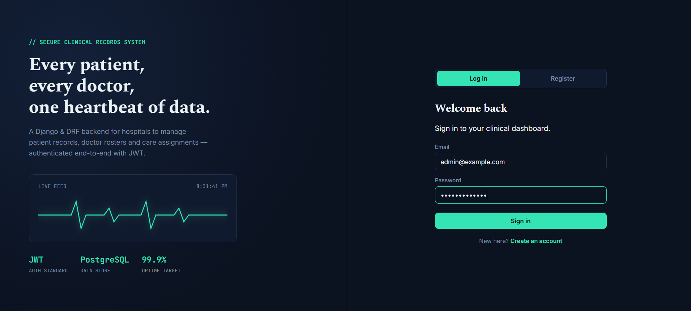<p align="center"><b>Login</b></p></td>
<td width="33%">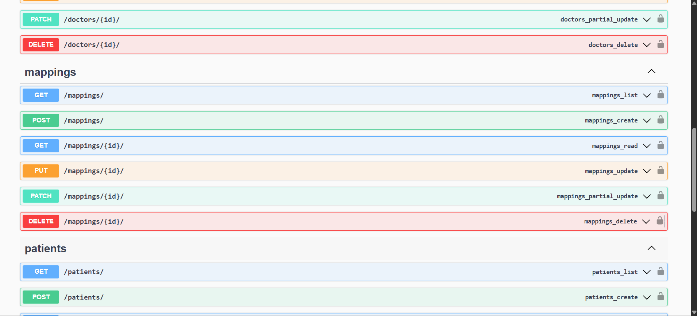<p align="center"><b>Register</b></p></td>
<td width="33%">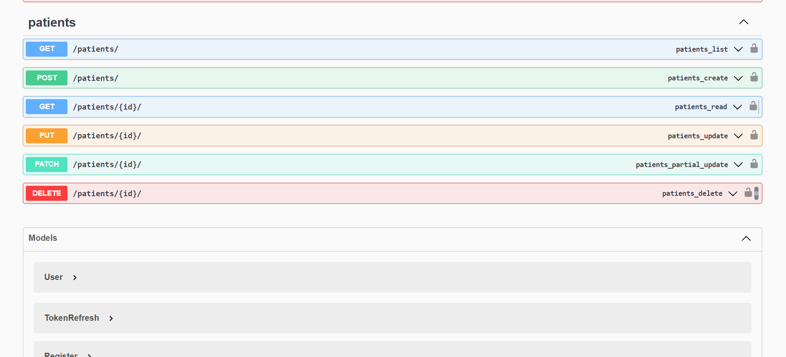<p align="center"><b>Validation Feedback</b></p></td>
</tr>
</table>

### Dashboard

<table>
<tr>
<td width="50%">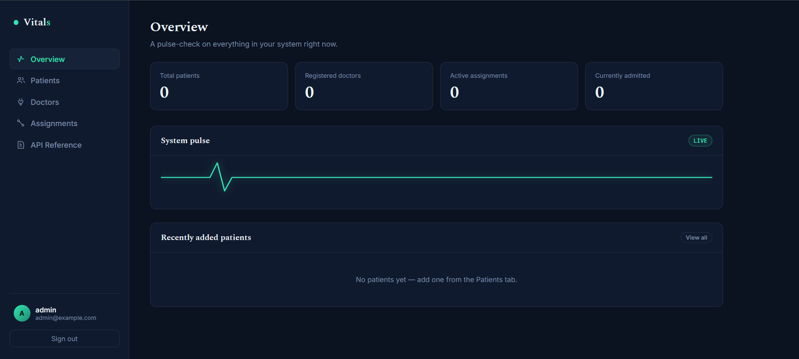<p align="center"><b>Overview — Live Stats</b></p></td>
<td width="50%">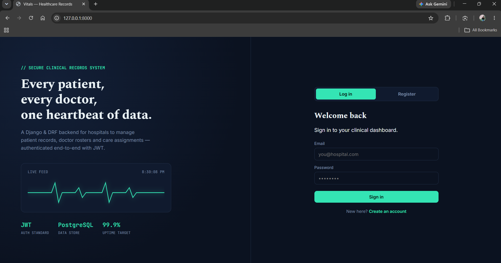<p align="center"><b>Dashboard Shell</b></p></td>
</tr>
</table>

### Patient Management

<table>
<tr>
<td width="50%">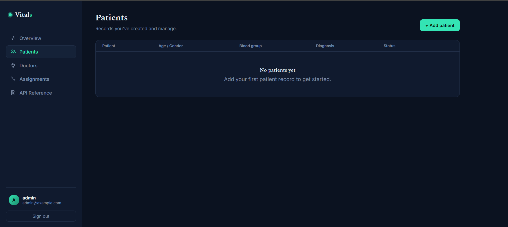<p align="center"><b>Patients List</b></p></td>
<td width="50%">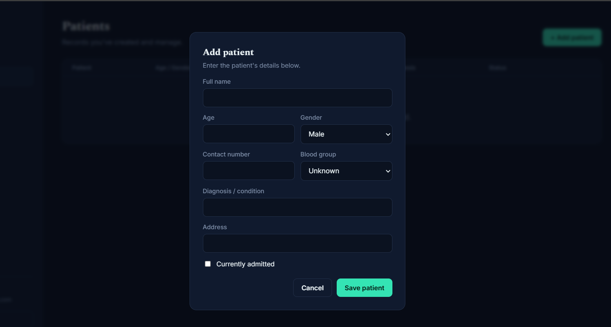<p align="center"><b>Add / Edit Patient</b></p></td>
</tr>
</table>

### Doctor Management

<table>
<tr>
<td width="50%">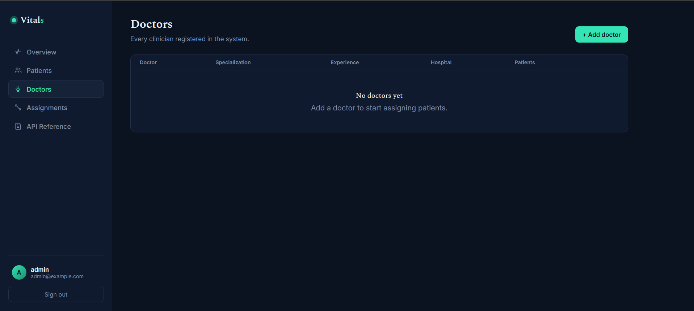<p align="center"><b>Doctors List</b></p></td>
<td width="50%">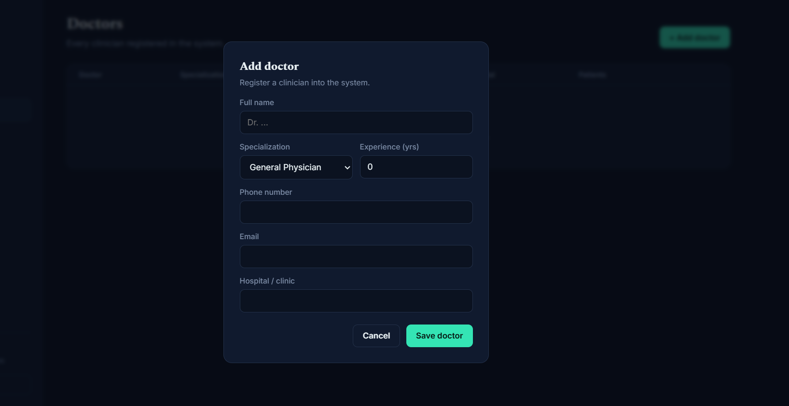<p align="center"><b>Add / Edit Doctor</b></p></td>
</tr>
</table>

### Patient–Doctor Assignments

<table>
<tr>
<td width="50%">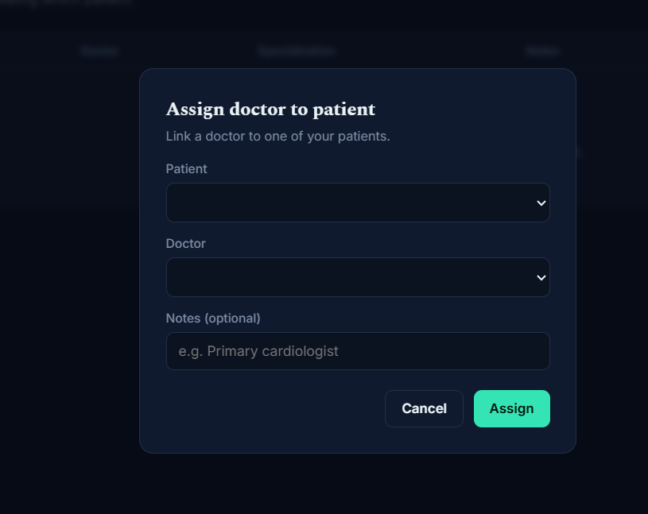<p align="center"><b>Assign Doctor to Patient</b></p></td>
<td width="50%"><p align="center"><b>All Assignments</b></p></td>
</tr>
</table>

### API Reference & Server

<table>
<tr>
<td width="33%">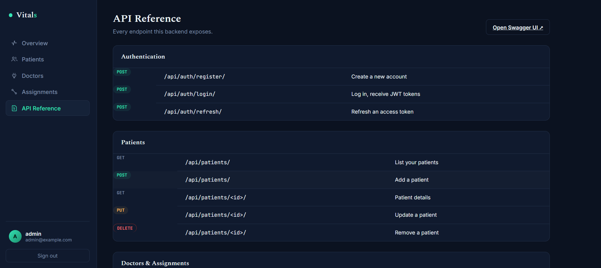<p align="center"><b>Swagger API Docs</b></p></td>
<td width="33%">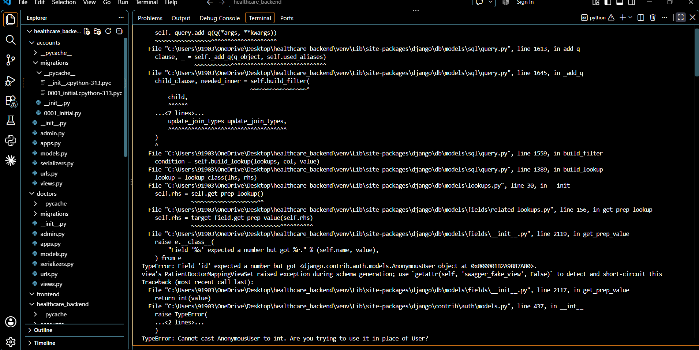<p align="center"><b>Environment Setup</b></p></td>
<td width="33%">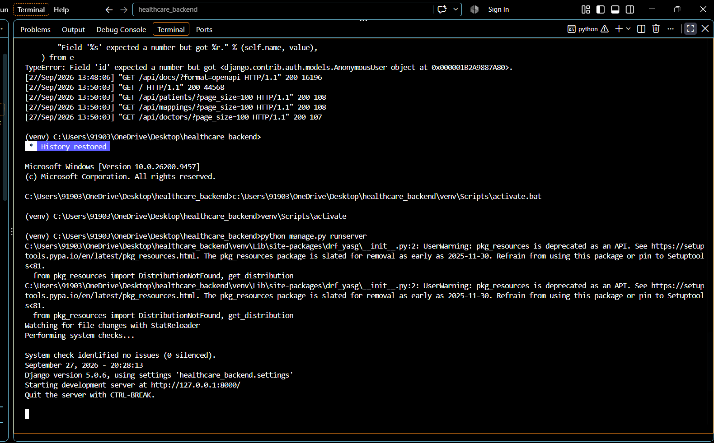<p align="center"><b>Server Running</b></p></td>
</tr>
</table>

</div>

---

## 🔑 API Endpoints

### Authentication
| Method | Endpoint | Description |
|---|---|---|
| `POST` | `/api/auth/register/` | Register a new user |
| `POST` | `/api/auth/login/` | Log in, receive JWT access & refresh tokens |
| `POST` | `/api/auth/refresh/` | Exchange a refresh token for a new access token |
| `GET` | `/api/auth/me/` | Get the current authenticated user's profile |

### Patients *(auth required, scoped to creator)*
| Method | Endpoint | Description |
|---|---|---|
| `POST` | `/api/patients/` | Add a new patient |
| `GET` | `/api/patients/` | List patients you created |
| `GET` | `/api/patients/<id>/` | Get details of a specific patient |
| `PUT` | `/api/patients/<id>/` | Update a patient's details |
| `DELETE` | `/api/patients/<id>/` | Delete a patient record |

### Doctors *(auth required)*
| Method | Endpoint | Description |
|---|---|---|
| `POST` | `/api/doctors/` | Add a new doctor |
| `GET` | `/api/doctors/` | Retrieve all doctors |
| `GET` | `/api/doctors/<id>/` | Get details of a specific doctor |
| `PUT` | `/api/doctors/<id>/` | Update a doctor's details |
| `DELETE` | `/api/doctors/<id>/` | Delete a doctor record |

### Patient–Doctor Mappings *(auth required)*
| Method | Endpoint | Description |
|---|---|---|
| `POST` | `/api/mappings/` | Assign a doctor to a patient |
| `GET` | `/api/mappings/` | Retrieve all your mappings |
| `GET` | `/api/mappings/<patient_id>/` | Get all doctors assigned to a specific patient |
| `DELETE` | `/api/mappings/<id>/` | Remove a doctor from a patient |

All authenticated requests require:
```
Authorization: Bearer <access_token>
```

---

## 🚀 Getting Started

```bash
# 1. Clone the repo and set up a virtual environment
git clone <your-repo-url>
cd healthcare_backend
python -m venv venv
venv\Scripts\activate          # Windows
# source venv/bin/activate     # macOS/Linux

# 2. Install dependencies
pip install -r requirements.txt

# 3. Configure environment variables
cp .env.example .env           # then fill in your SECRET_KEY and DB credentials

# 4. Create the PostgreSQL database
# (via psql or pgAdmin)  ->  CREATE DATABASE healthcare_db;

# 5. Run migrations
python manage.py makemigrations
python manage.py migrate

# 6. Create an admin user (optional)
python manage.py createsuperuser

# 7. Run the server
python manage.py runserver
```

Then open:
- 🖥️ **Dashboard:** `http://127.0.0.1:8000/`
- 📖 **Swagger Docs:** `http://127.0.0.1:8000/api/docs/`
- ⚙️ **Django Admin:** `http://127.0.0.1:8000/admin/`

---

## 🧱 Design Decisions

- **Patients are private to their creator** — `GET /api/patients/` returns only patients the logged-in user created; detail, update and delete are all scoped the same way so no one can touch a record by guessing an ID.
- **Doctors are shared** — any authenticated user can view the full doctor roster.
- **Duplicate assignments are blocked** at both the database level (`unique_together` on patient + doctor) and the serializer level, with a clear validation message.
- **One consistent error shape** — `healthcare_backend/exceptions.py` normalizes every DRF error into `{ success, message, errors }`, so no client ever has to special-case error responses.

---

## 📂 Project Structure

```
healthcare_backend/
├── accounts/          # Custom User model, JWT register/login/refresh
├── patients/           # Patient model, serializer, viewset
├── doctors/             # Doctor model, serializer, viewset
├── mappings/            # Patient–Doctor mapping model, serializer, viewset
├── healthcare_backend/  # Project settings, URLs, custom exception handler
├── templates/           # Dashboard UI (index.html)
└── static/               # Static assets
```

---

## 👩‍💻 Author

Built with care, curiosity, and a lot of debugging. If you found this useful, a ⭐ on the repo goes a long way!
